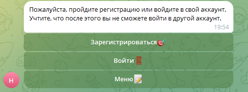
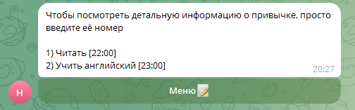
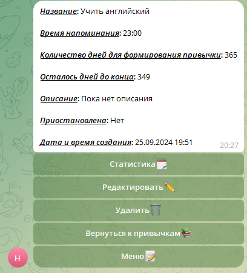
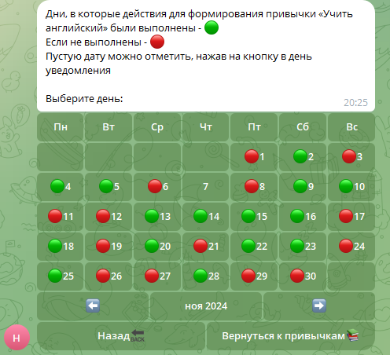
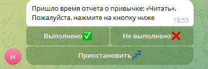

# Чат-бот для трекинга привычек
___

## Окно регистрации

___
## Список привычек пользователя

___
## Детали привычки

## Статистика выполнения заданий для формирования привычки

___
## Напоминание о том, что нужно выполнить действия для формирования привычки


___
# Основные используемые фреймворки и инструменты

* ### [FastAPI](https://fastapi.tiangolo.com/)
* ### [Pydantic](https://docs.pydantic.dev/latest/)
* ### [pydantic-settings](https://docs.pydantic.dev/latest/concepts/pydantic_settings/)
* ### [SQLAlchemy](https://www.sqlalchemy.org/)
* ### [Alembic](https://alembic.sqlalchemy.org/en/latest/)
* ### [Postgres](https://www.postgresql.org/)
* ### [PyJWT](https://pypi.org/project/PyJWT/)
* ### [bcrypt](https://pypi.org/project/bcrypt/)
* ### [pyTelegramBotAPI](https://pypi.org/project/pyTelegramBotAPI/)
* ### [python-telegram-bot-calendar](https://pypi.org/project/python-telegram-bot-calendar/)
* ### [APScheduler](https://pypi.org/project/APScheduler/)
* ### [requests](https://pypi.org/project/requests/)
* ### [Redis](https://devdoc.net/database/redis-site-20210120/documentation.html)

## Возможности пользователя:
* Создавать привычку
* Удалять привычку
* Редактировать привычку
* Смотреть статистику выполнений
* Отмечать привычку по уведомлению
* Входить в свой профиль через разные телеграм аккаунты


## Установка

* Убедитесь, что docker установлен на локальной машине ([Как установить Docker?](https://docs.docker.com/get-started/get-docker/))
* Склонируйте репозиторий на локальную машину
```sh
https://github.com/raydqver/tracking-habits.git
```

* Создайте файл .env co своими данными в директориях backend и frontend и скопируйте все из .env_template,
либо введите свои данные (TOKEN нужно ввести свой обязательно)

* Запустите докер контейнер и подождите около 2 минут
```sh
docker compose up
```

## CERTS
В данной директории хранятся файлы private.pem и public.pem с 
закрытым и открытым ключами соответственно для шифрования JWT-токенов. 
Они генерируются автоматически запуском скрипта create_certs.py внутри докера.

## Данные в .env_template

#### DB_HOST - Хост базы данных
#### DB_PORT - Порт базы данных
#### POSTGRES_USER - Логин пользователя 
#### POSTGRES_PASSWORD - Пароль пользователя
#### POSTGRES_DB - Название базы данных на стороне api

#### TOKEN - Токен бота от [BotFather](https://telegram.me/botfather)
#### API_HOST - Хост, на котором работает api
#### DB_NAME - Название базы данных на стороне бота
#### REDIS_HOST - Хост редиса
#### PORT - Порт, на котором работает api